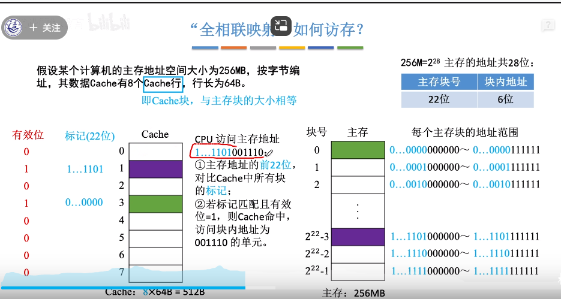
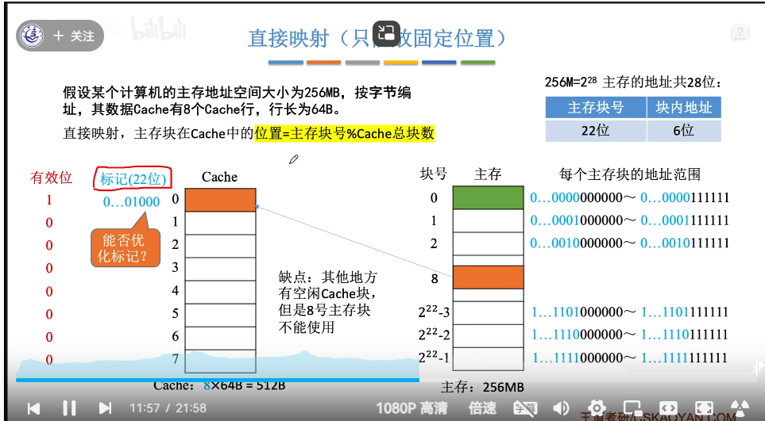
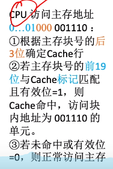
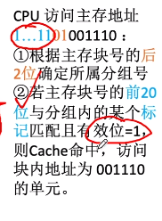
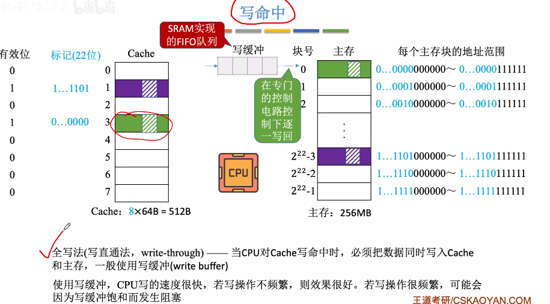
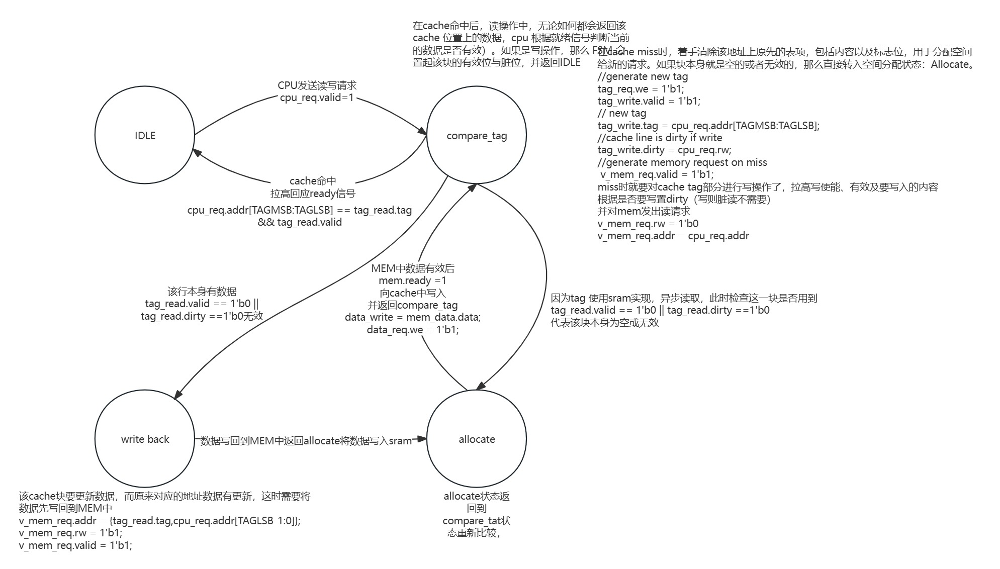

# RISC-V 五级流水线CPU

## RV32I指令集

在该工程中，实现了上述RV32I的基础指令集，具体的各个指令功能可以参照文件中的riscv-card。

## 冒险处理

1.ALU->ALU的冒险，在这里分为三种，

ALU->ALU(两条指令相邻，下一条指令用到了上一条指令的处理结果)

ALU-> -> ALU(两条中间隔了一条指令，下一条指令用到了上上一条指令的处理结果)

ALU-> ->  ->ALU(两条中间隔了两条指令，下一条指令用到了上上上一条指令的处理结果)

在这里均使用forward logic解决，除此之外针对中间相隔两条的情况，还可以使用regfile在下降沿写入数据。

对应于 ： cpu_tb.v Hazard 1-6

2.two alu，three alu冒险

ALU 在运算时要使用到之前指令得到的两个寄存器值

该冒险类似于第一条，使用forward logic解决即可

对应于 ： cpu_tb.v Hazard 7-8

3.MEM <-> ALU、MEM->MEM冒险

在这里主要是指store load指令与ALU交互时存在的冒险

对于ALU -> MEM 这里是指上一条指令修改寄存器的值， store指令需要用到ALU的结果。使用forward logic 解决即可

对于MEM ->MEM、MEM->ALU这里是指load指令存在的冒险，由于load指令取出数据较晚，不能使用forward logic解决，需要将流水线停顿，直到取出正确正确数据为止。

对应于 ： cpu_tb.v Hazard 9-11

4.Branch 产生的冒险

主要考虑分支跳转，为了保证cpi，我们这边使用了最简单的动态分支预测，即使用2bit饱和计数器

所谓2-bit计数器，即每条指令PC,通过一个2-bit的计数器，记录历史跳转情况：

（1）2-bit所能记录的数字包含00/01/10/11。

（2）分支实际跳转一次，计数器+1，不跳转，则-1。

（3）2-bit计数器当前状态为10或者11，则预测本次跳转，如果为00或者01，则预测本次不跳转。

实际研究表明，2-bit计数器相较于1-bit精度较高，如果再提高到3-bit，精度提升不明显。因此业界大多使用2-bit计数器。

在分支预测失败时，我们需要产生flush信号来冲刷掉之前进行的信号。

对应于 ： cpu_tb.v Hazard 12

5.JAL、JALR 写回冒险

同1、2,还是ALU数据的问题使用forward logic即可

对应于 ： cpu_tb.v Hazard 13-14

## 结果电路图

## 仿真结果

## 综合布线结果

资源用量

各模块消耗量

然而不幸的是，我的是时序报告如下：

这说明时序很好，所以也无法算出最大频率——感觉是时序约束错了（可能，不太懂）

##  cache基本概念

局部性原理：

（1）空间局部性 ： 在最近的未来要用到的信息很可能与现在正在使用的信息在存储空间上是临近的

（2）时间局部性：在最近的未来要用到的信息，很可能是现在正在使用到的信息。

-> 把CPU目前访问的地址周围的部分数据放到cache中

增加cache后的性能分析：

tc为访问cache所需时间，tm为访问一次主存所需时间，命中率H 未命中率 M=1-H

平均访问时间t = Htc + M（tc+tm） / Htc + M（tm）

待解决的问题：根据局部性原理，要将cpu访问的地址哪一周围部分放到cache中呢。将主存进行分块 ，主存与cache之间以块为单位进行数据交换

如主存地址共22位（4MB大小） 块号 12位 块内地址10位分成了大小为1kb的4096块

注： cache中的块也称为行 ，主存中的块也称为页、页面、页框

每次被访问的主存块，一定会被立即调入Cache

## cache与主存的映射方式

（1）全相联映射：主存块可以放在cache的任意位置

（2）直接映射：每个主存块只能放到一个特定的位置 cache块号 = 主存块号%cache总块数

（3）组相联映射 ：cache块分为若干组，每个主存块可放到特定分组中的任意一个位置 组号=主存块号%分组数

如何区分cache中存放的是哪个主存块->给每个cache块增加一个标记并增加一个有效位

直接映射的标记可以进行优化 主存块号末尾反映了映射的位置，因此该例子中使用19位即可

组相联映射：所属分组=主存块号%分组数

2路组相联映射 ：两块为一组

在该例子中块号为最后两位，因此考虑20位做标记即可

## Cache 替换算法

cache很小 主存很大 那么如果cache满了怎么办

（1）全相联映射 ： cache完全满了才需要替换需要在全局选择替换哪一块

（2）直接映射：对应位置非空，则毫无选择直接替换

（3）组相联映射：分组内满了才需要替换，需要在分组内选择替换哪一块

因此考虑第一种情况与第三种情况即可

cache的替换算法包括：随机算法(rand)、先进先出算法(FIFO)、近期最少使用（LRU）、最近不经常使用（LFU）

随机算法:cache满了 随机选择一块替换  实现简单，但是命中率低，不稳定

先进先出算法：若cache已满，则替换最先被调入cache的块，实现简单，但是依然没考虑局部性原理

近期最少使用算法：为每一个cache块设置一个计数器，用于记录每个cache块已经有多久没被访问，当cache满后替换计数器最大的。在硬件上，命中时，所命中行计数器清零，比其低的计数器+1，其余不变，未命中还有空闲行，新装入的置0，其余非空闲行全加1，未命中且无空闲行时，计数值最大的行信息块被淘汰，新装行计数器置0。 实际运行效果优秀，cache命中率高，但是若频繁访问的主存块数量>cache行数量，则有可能发生抖动

最不经常使用算法：为每一个cache块设置一个计数器，用于记录每个cache块被访问过几次，当cache满后替换计数器最小的。曾经被经常访问的主存块在未来不一定会用到，实际运行效果不如LRU。

## cache写策略

cpu修改了cache中的数据副本，如何确保cache和主存数据一致

分为写命中和写不命中的情况

对于写命中的情况

（1）写回法：

当cpu对cache写命中时， 只修改cache的内容，而不立即写入主存，只有当此块被换出时才写回主存。而未被修改的块不必写回。减少了访存次数，但存在数据不一致情况。

（2）全写法：

当cpu对cache写命中时，必须把数据同时写入cache和主存，一般使用写缓冲（write buffer） 可以使cpu写速度很快，若写操作不频繁，效果很好，若写操作频繁，则会阻塞

对于写不命中的情况

（1）写分配法：

把主存中的块调入cache，在cache中修改，搭配写回法使用

（2）非写分配法：

cpu直接往主存写数据而不调入cache，搭配全写法使用

## Cache 实现

Cache 作为连接Imem和Dmem的中间mem，

这里以***《计算机组成与设计 硬件软件接口》（第五版）章 5.12 进阶内容：实现 cache*** 为例

[https://booksite.elsevier.com/9780124077263/appendices.php](https://aijishu.com/link?target=https%3A%2F%2Fbooksite.elsevier.com%2F9780124077263%2Fappendices.php)

特点：

- 直接映射的 cache 组织方式，每个地址对应于唯一的 cache 块
- 写回机制
- 写分配策略，即在写缺失时更新 cache 块
- 块大小为 4 个字，即 128 bit
- cache 大小为 16KB，即 1024 个块

一般来说Cache包括

输入：

​	cpu request ：  addr  由 tag index block offset四部分组成

​								data 

​								rw   read or write

​								valid    request有效

​	mem data   ：data	

​							 ready

输出：

​	mem req ： addr 

​							data	

​							rw

​							valid

​	cpu	result ：data 

​							ready

​			

实现包括两部分 cache tag 部分和 cache data部分 具体使用状态机实现：

关于req_addr ： 关于地址的解析，由于本实验要求的Cache每路为 128 行，因此 index 需要 7 位，即 2^7 = 128；每行由 8 个块构成， 每个块 32 位（4 个字节），因此 offset 需要 5 位，即 2^5 = 8 * 4；地址其余 20 位作为 tag 。

index 对应cache 的行  cache共 2^index行

每行块对应 block 

每个块有多少位对应offset

IMEM 与DMEM的区别，DMEM需要有写功能，而IMEM不需要